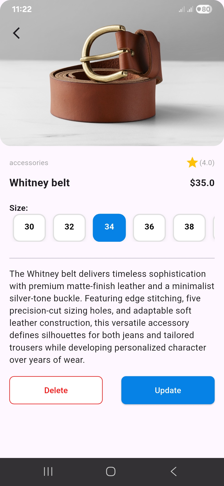
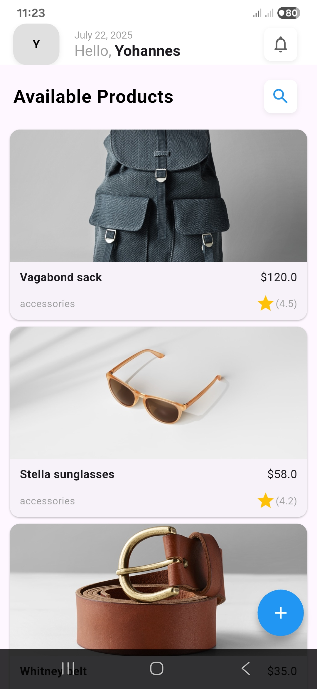
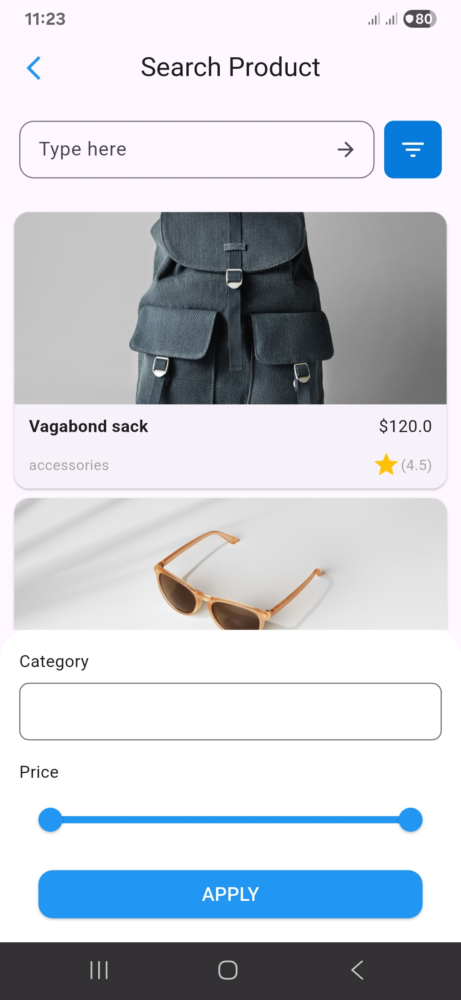
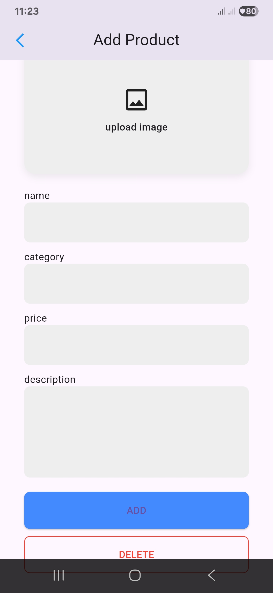
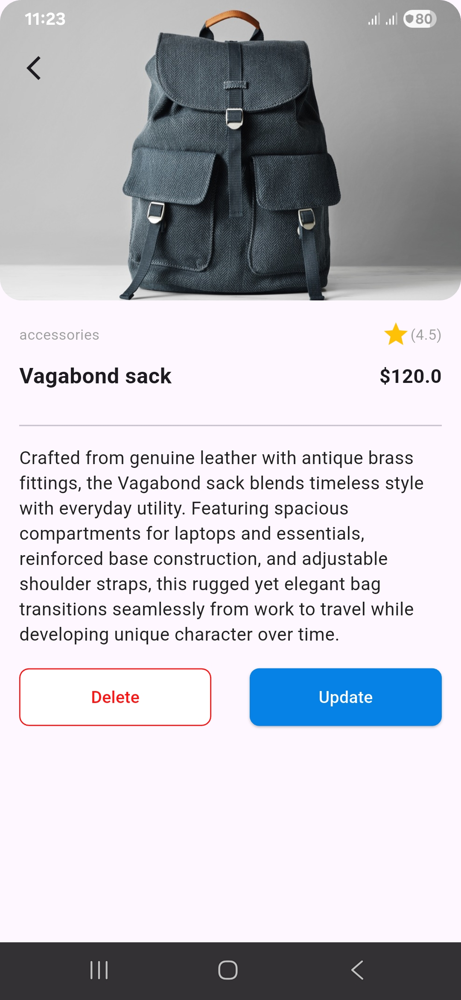

# Ecommerce UI Flutter Project

## Description

This project is a Flutter-based mobile application that simulates a simple ecommerce platform. Users can browse a list of products, view detailed information about each product, add new products, update existing ones, and delete products. The app features a modern user interface inspired by a provided design reference, with attention to layout, colors, and usability.

Navigation between screens is handled using Flutter's named routes, ensuring a smooth and intuitive user experience. Data is passed between screens to support product creation and editing. The app also includes search and filter functionality, allowing users to find products by category and price range.

This project demonstrates best practices in Flutter development, including state management, form validation, and responsive UI design.

## Architecture

This project follows the Clean Architecture pattern for better separation of concerns and maintainability.

- `core/`: Contains shared components, error handling, and base classes used throughout the app.
- `features/`: Contains feature-specific modules. The main module is `features/product`, which handles all product-related logic, including entities, use cases, repositories, and data models.
- `test/`: Contains all unit and widget tests, organized to mirror the `lib/` structure.

## Data Flow

- The UI interacts with the domain layer through use cases.
- Use cases communicate with repositories to perform CRUD operations.
- Repositories abstract the data source (local or remote) and return entities to the domain layer.
- Models are used for JSON serialization/deserialization and are converted to entities for use in the domain layer.

## Error Handling

Error handling is managed in the `core` layer using custom `Failure` classes. All use cases return either a successful result or a failure, ensuring robust error management throughout the app.

## Features

- Home screen displaying a list of products
- Add/Edit product screen with validation
- Product detail screen with size selection
- Search and filter products by category and price
- Smooth navigation and transitions between screens
- Data passing between screens for product management

## Screenshots
 
<table>
  <tr>
    <td></td>
    <td></td>
  </tr>
  <tr>
    <td></td>
    <td></td>
  </tr>
  <tr>
    <td></td>
    <td></td>
  </tr>
</table>

## Getting Started

1. Clone the repository:
    ```
    git clone https://github.com/yourusername/2025-project-phase-mobile-tasks.git
    ```
2. Navigate to the project folder:
    ```
    cd 2025-project-phase-mobile-tasks/mobile/Natnael/ecommerce_ui
    ```
3. Get dependencies:
    ```
    flutter pub get
    ```
4. Run the app:
    ```
    flutter run
    ```

## Project Structure

- `lib/core/` - Shared core logic and error handling
- `lib/features/` - Feature modules (e.g., product)
- `test/` - Unit and widget tests
- `screen_shots/` - UI screenshots for reference

## Testing

The project includes comprehensive unit tests for models, use cases, and repositories.

To run all tests:
```
flutter test
```

## Notes

- Images used for products are placeholders; you can replace them with your own.
- All navigation uses named routes for clarity and maintainability.

## Author